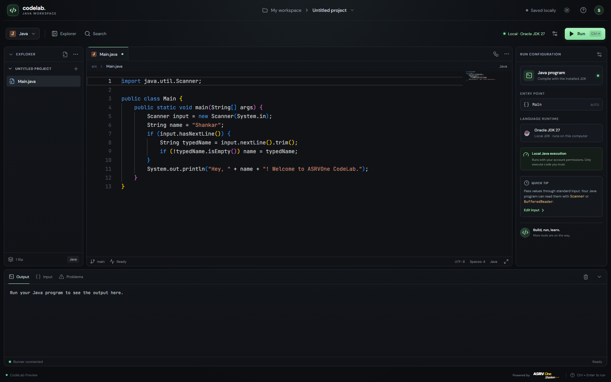
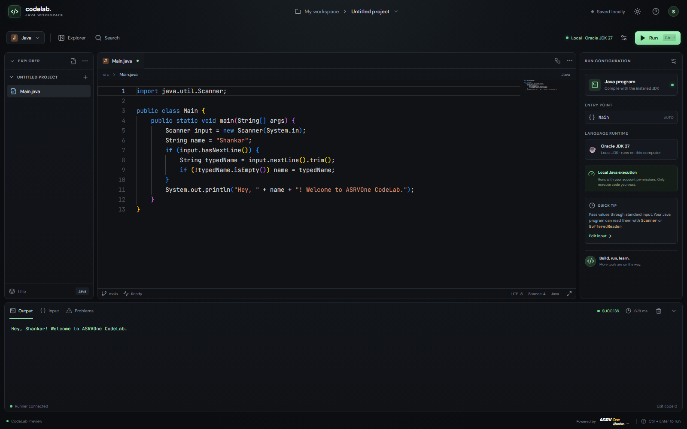
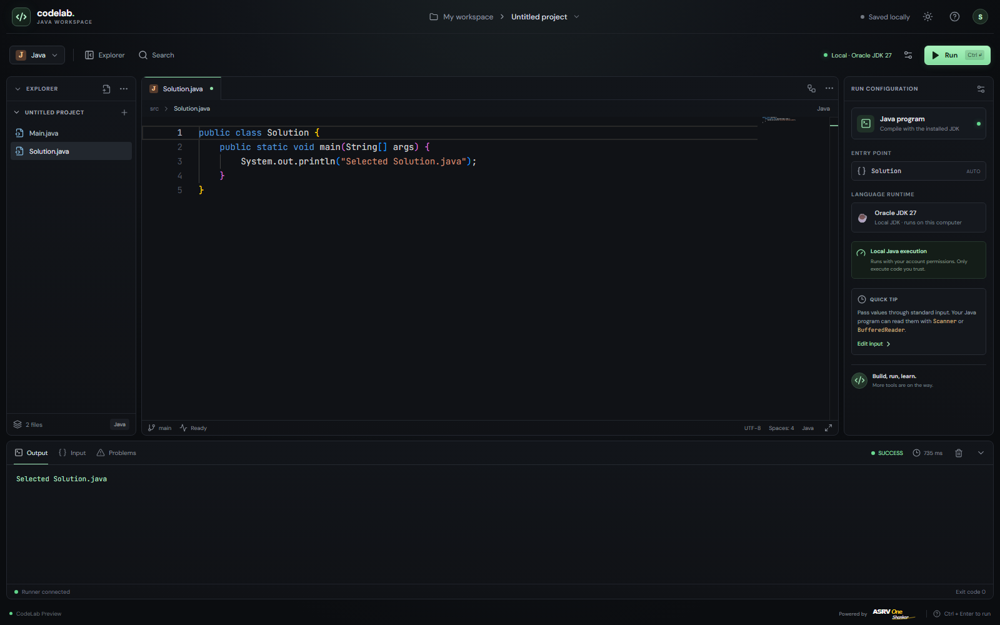
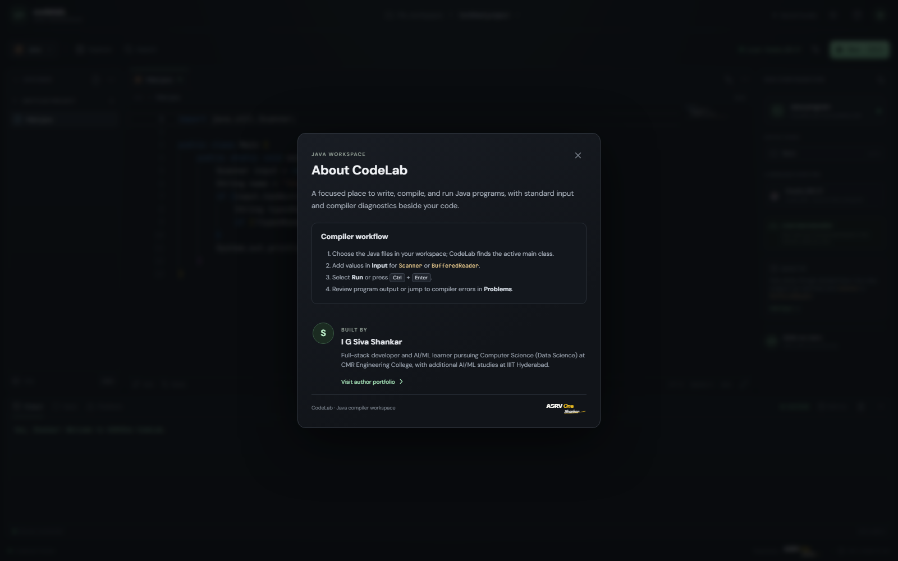
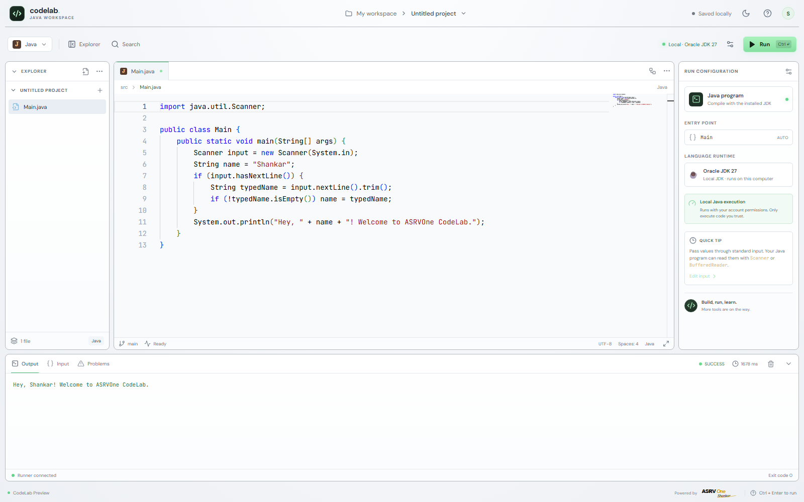

# CodeLab

CodeLab is a browser-based Java workspace with a Monaco editor, local project files, standard input, compiler diagnostics, and a Java run panel. Code and input stay in the browser's local storage; the development app does not require an account.

## Screenshots

The screenshots below show the running application and its Java compile/run workflow.












## Requirements

- Node.js 20 or newer and npm
- Python 3.12 or newer
- A JDK with both `java` and `javac` on `PATH`, or `JAVA_HOME` configured
- Docker Desktop or Docker Engine only for isolated container runs

## Run locally with your installed JDK

From the repository root, install web and Python dependencies once.

**Windows PowerShell:**

```powershell
npm ci
py -3.12 -m venv .venv
.\.venv\Scripts\python.exe -m pip install -r apps/api/requirements.txt -r services/java-runner/requirements.txt
```

**macOS / Linux:**

```sh
npm ci
python3.12 -m venv .venv
.venv/bin/python -m pip install -r apps/api/requirements.txt -r services/java-runner/requirements.txt
```

Start the API, Java runner, and web app together:

```sh
npm run dev
```

Open [http://localhost:5173](http://localhost:5173). The runtime badge shows the detected local JDK. The launcher reuses a Vite server already listening on port 5173, and prints the platform-specific Python environment path if dependencies need installing.

## Compile and run a program

1. Open a `.java` file in Explorer, or add one with **New Java file**.
2. Write a class with `public static void main(String[] args)`. CodeLab runs the active file when it contains `main`; otherwise it selects `Main.java`, then the first file containing `main`.
3. Select **Input** and type the lines your program reads from `System.in` with `Scanner` or `BufferedReader`.
4. Select **Run** or press **Ctrl+Enter** ( **Cmd+Enter** on macOS) to compile and execute the selected program.
5. Read standard output and runtime errors in **Output**. Compilation diagnostics are listed in **Problems**; selecting one opens the corresponding source line.

The [compiler workflow guide](docs/compiler-workflow.md) documents the compile, execute, diagnostics, and output flow.

`Main.java`, `Solution.java`, and additional files share one project submission. The runner creates a temporary project folder for each run and removes it after the job finishes. The app saves files, input, and theme to the current browser profile's local storage; they are not synced to other devices.

## Execution modes

`npm run dev` uses the JDK installed on the development computer. It creates temporary source and class directories, sets JVM memory and execution-time limits, bounds captured output, and binds local services to the loopback interface. Local mode is **not an operating-system security sandbox**: Java code has the permissions of the account running the app. Use it for code you trust.

For Docker-isolated execution, install and start Docker Desktop (Windows and macOS) or Docker Engine (Linux), then run:

```sh
npm run dev:sandbox
```

Docker Compose builds the Java runtime and starts the web app, API, and runner. Each execution uses a disposable container with networking disabled and CPU, memory, process, and time limits. Inspect service health with `docker compose ps`; view logs with `docker compose logs api java-runner`.

`npm run dev:web` starts only the editor and needs a CodeLab API at `http://localhost:8000` to execute programs.

## Public deployment

Vercel can host the static editor; Java execution for this configuration runs on a Linux VM with Docker Engine. See [docs/deploy-vercel.md](docs/deploy-vercel.md) for the frontend and API setup. A Vercel-only deployment does not run Java with the current Docker-backed runner. The browser calls the API host directly over HTTPS. Configure its allowed browser origins before opening the service publicly.

The current API keeps jobs in memory, so deploy one API replica. Each visitor has a separate browser-local workspace; there are no shared projects, sign-in, or cross-device sync in this version.

## Project docs

- [Compiler workflow](docs/compiler-workflow.md)
- [Architecture and runtime contract](docs/architecture.md)
- [Vercel frontend and Linux runner setup](docs/deploy-vercel.md)
