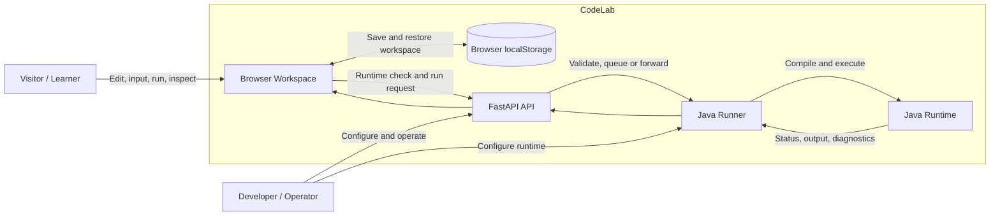
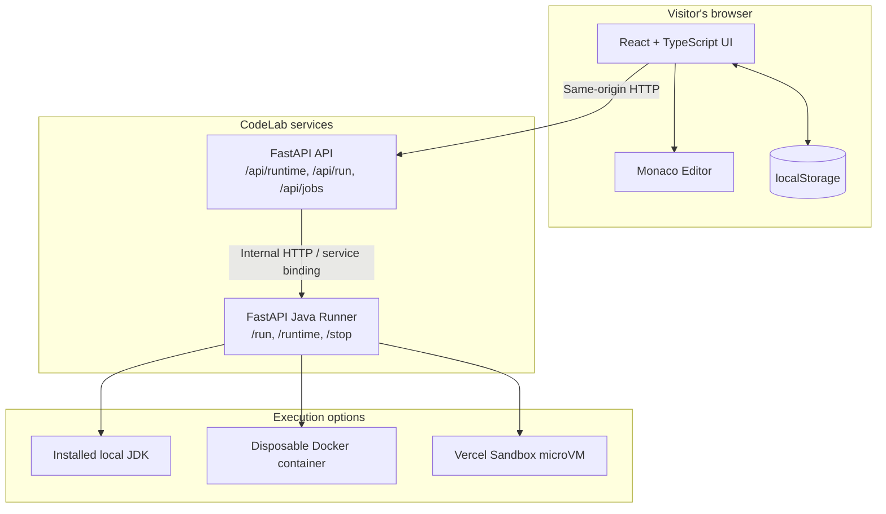
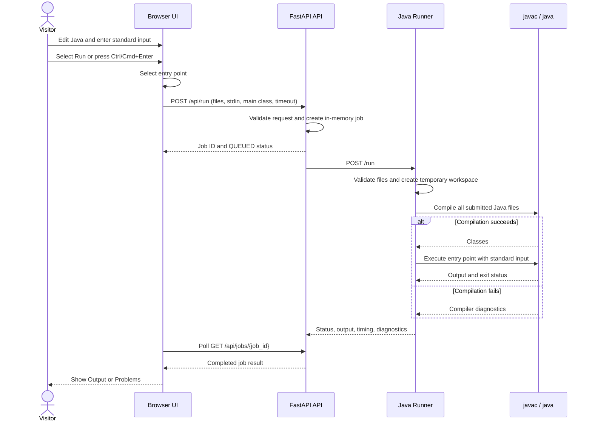
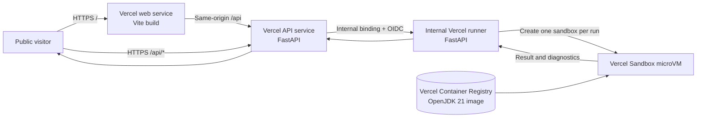
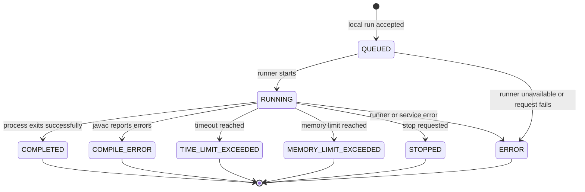

# CodeLab Project Documentation

**Project report, software requirements specification, system design, and user manual**

**Version:** 1.0 (V1)
**Status:** Publicly deployed

## Contents

- [Project at a glance](#project-at-a-glance)
- [Story and motivation](#story-and-motivation)
- [Goals and scope](#goals-and-scope)
- [People and use cases](#people-and-use-cases)
- [Software requirements specification](#software-requirements-specification)
- [Technology stack](#technology-stack)
- [Architecture and UML diagrams](#architecture-and-uml-diagrams)
- [Java execution workflow](#java-execution-workflow)
- [User manual](#user-manual)
- [API overview](#api-overview)
- [Security, privacy, and limitations](#security-privacy-and-limitations)
- [Screenshots](#screenshots)
- [Development and deployment](#development-and-deployment)
- [Testing and acceptance checks](#testing-and-acceptance-checks)
- [Roadmap](#roadmap)
- [Project links and acknowledgments](#project-links-and-acknowledgments)

## Project at a glance

CodeLab is a browser-based workspace for writing, compiling, and running Java programs. It combines a Monaco editor, a multi-file project explorer, standard input, compiler diagnostics, and output panels. The browser stores the current workspace locally; Java compilation and execution happen in a separate runtime service.

| Item | Description |
| --- | --- |
| Project | CodeLab |
| Product type | Browser-based Java development and learning tool |
| Primary users | Students, interview candidates, and developers experimenting with Java |
| Interface | React web application with Monaco editor |
| Runtime | Java through a FastAPI API and Java runner |
| Persistence | Browser local storage; no account required |
| Production URL | [asrvone-codelab.vercel.app](https://asrvone-codelab.vercel.app) |

## Story and motivation

CodeLab began with a practical need: a Java workspace that could be opened from anywhere, without first setting up a local JDK. The point was not to have an AI provide the answer to every coding thought. The point was to write the logic, make mistakes, debug, experiment, and understand why a solution works.

Building it became a way to learn the technology by using it. A central engineering challenge was making a real JDK execution environment work in a Vercel deployment. Execution architecture and sandboxing required experimentation and debugging. Vivek Chittibothula contributed significantly to the engineering effort and helped solve the JDK environment challenge.

CodeLab is not presented as the first online compiler. It is an implementation of a problem its creators wanted to solve for themselves, made useful to other learners and developers too.

> Open -> Think -> Code -> Run -> Experiment -> Learn

## Goals and scope

### V1 goals

- Make a Java editor and JDK-backed execution environment available from a browser.
- Keep the path from editing to execution short and understandable.
- Support standard input, multi-file Java projects, output, runtime errors, and compiler diagnostics.
- Provide a local development mode and isolated deployment/runtime options.
- Keep a visitor's project data in their own browser profile without requiring registration.

### V1 exclusions

The current version does not provide user accounts, server-side project persistence, cross-device synchronization, shared projects, collaboration, AI code generation, multiple programming languages, automated problem judging, or competitive programming submissions. These are not implied by the V1 requirements; some are possible future directions.

## People and use cases

### Actors

- **Visitor / learner:** opens the public workspace, edits Java, supplies input, and runs programs.
- **Developer / operator:** installs the local toolchain, starts services, checks health and logs, or deploys the service stack.
- **Java runner:** internal service that validates a run, compiles source, executes the entry point, and returns results.

### Use cases

1. Create or edit Java source files in a project.
2. Enter standard input and execute the selected program.
3. Inspect output, exit status, runtime errors, and compiler diagnostics.
4. Navigate from a diagnostic to its source file and line.
5. Change the editor theme and continue a workspace in the same browser profile.
6. Run the application locally with an installed JDK or Docker, or use the public Vercel deployment.

## Software requirements specification

### Functional requirements

| ID | Requirement | Acceptance condition |
| --- | --- | --- |
| FR-01 | The workspace shall edit Java source in the browser. | A visitor can edit a `.java` file in the editor. |
| FR-02 | The workspace shall manage project files and folders. | A visitor can create, rename, delete, and select nested entries using Explorer. |
| FR-03 | The workspace shall select a Java entry point. | Use the active file if it contains `main`; otherwise prefer `Main.java`, then the first Java file containing `main`. |
| FR-04 | The workspace shall accept standard input. | Text entered in **Input** is delivered to the program's `System.in`. |
| FR-05 | The workspace shall submit a run and show its result. | A run returns a status and displays output, runtime errors, or an actionable runner error. |
| FR-06 | The workspace shall show compiler diagnostics. | `javac` diagnostics appear in **Problems** and can navigate to a source location. |
| FR-07 | The workspace shall support a keyboard run command. | `Ctrl+Enter` runs on Windows/Linux and `Cmd+Enter` on macOS. |
| FR-08 | The workspace shall retain local preferences and project data. | Files, folders, project name, input, theme, and panel sizing are stored in browser local storage. |
| FR-09 | The UI shall report runtime availability. | The runtime status is obtained from the API and identifies Java availability/version when available. |
| FR-10 | The system shall support local and deployed execution. | Local development can use the installed JDK; Docker and Vercel use isolated execution paths. |

### Non-functional requirements

| ID | Requirement |
| --- | --- |
| NFR-01 | **Input validation:** accept only relative Java source paths, reject traversal or invalid paths, and enforce request limits. |
| NFR-02 | **Resource bounds:** bound run time, memory, process count where applicable, and captured output in isolated execution modes. |
| NFR-03 | **Network isolation:** disable outbound networking for Docker and Vercel sandbox executions. |
| NFR-04 | **Privacy:** do not require accounts; keep workspace data in the visitor's browser local storage. |
| NFR-05 | **Usability:** expose editing, input, output, and diagnostics in the workspace without requiring command-line Java knowledge from visitors. |
| NFR-06 | **Maintainability:** separate web UI, API coordination, and Java execution into distinct services. |
| NFR-07 | **Portability:** document Windows PowerShell and macOS/Linux local setup. |

### Operating limits and assumptions

- The local development setup requires Node.js 20+, npm, Python 3.12+, and a JDK with `java` and `javac` on `PATH` or `JAVA_HOME` configured.
- A run accepts 1-80 Java files, source content up to 500 KB total, standard input up to 64 KB, and a requested timeout greater than 0 and no more than 30 seconds.
- The local queue is in memory and is not shared across API instances. Production Vercel execution is synchronous and does not use that queue.
- A standalone web build is not sufficient to execute Java. The API and a reachable Java runner must also be available.

## Technology stack

| Layer | Technologies | Responsibility |
| --- | --- | --- |
| Web application | React 18, TypeScript 5.7, Vite 6 | Browser workspace, state, panels, and API calls |
| Code editor | Monaco Editor via `@monaco-editor/react` | Java editing, themes, keyboard commands, and diagnostic markers |
| Icons | Lucide React | Workspace controls and interface icons |
| API | Python 3.12, FastAPI, Pydantic 2, HTTPX | Request validation, runtime health, local job tracking, and runner communication |
| Java runner | Python 3.12, FastAPI, Docker SDK, Vercel Python SDK | Runtime selection, input validation, compilation/execution coordination, output and diagnostics |
| Java runtime | Local installed JDK; Docker image; OpenJDK 21 sandbox image | Compile Java with `javac` and run with `java` |
| Local isolated deployment | Docker Compose | Web/API/runner services and disposable Java containers |
| Public deployment | Vercel Services, Vercel Container Registry, Vercel Sandbox | Web, API, internal runner, and per-run Java microVM |
| Browser persistence | `localStorage` | Files, folders, project name, input, theme, and panel dimensions |

Versions are governed by the project manifests and deployment images. Refer to `package.json`, `apps/web/package.json`, Python requirement files, and `services/java-runner/sandbox-image/Dockerfile` for the exact ranges and image base.

## Architecture and UML diagrams

### System context / use case diagram



### Component diagram



### Local run sequence



On Vercel, the API sends the request synchronously through its internal service binding to the runner; the browser does not use the local job-polling flow for that deployment.

### Deployment diagram



### Run lifecycle states



## Java execution workflow

1. The UI chooses an entry point: active Java file with a `main` method, else `Main.java`, else the first Java file with `main`.
2. It submits relative `.java` file paths, source text, selected main class, standard input, and timeout to `POST /api/run`.
3. The API validates file names, source size, and request shape. In local development, it registers an in-memory job and starts runner work in the background.
4. The runner validates the project again, writes it to a fresh temporary workspace, and compiles all submitted source files with `javac`.
5. On successful compilation, the runner executes the entry point with the submitted text connected to `System.in`.
6. The runner returns process status, output, exit code, elapsed time, and parsed compiler diagnostics. The UI shows output/errors in **Output** and diagnostics in **Problems**.
7. The temporary project is removed when execution finishes.

Compilation precedes execution. A compilation failure produces diagnostics and does not start the program.

## User manual

### Open CodeLab

Go to [https://asrvone-codelab.vercel.app](https://asrvone-codelab.vercel.app). The starter project opens in the browser. The workspace checks whether the Java runtime is available. No account is needed.

### Edit a project

- Edit the selected file in the center editor.
- Use **Explorer** to add files and folders, search entries, and rename or delete project entries.
- The active file appears in the editor. When running, CodeLab selects a `main` entry point using the priority described above.
- Use the project breadcrumb to rename the project.
- Use the theme control to switch between dark and light themes.

### Provide input and run

1. Select **Input** in the lower panel.
2. Enter input lines in the order the Java program reads them. For example, read these with `Scanner.nextLine()` or `BufferedReader.readLine()`.
3. Select **Run**, or press `Ctrl+Enter` on Windows/Linux or `Cmd+Enter` on macOS.
4. Wait for the run to finish. While running, the UI indicates the active job; use the stop control when available to request cancellation.

### Read output and fix errors

- **Output** displays program output, standard error/runtime failures, and run status information.
- **Problems** displays compiler diagnostics. Select a diagnostic to navigate to its file and line.
- A compile error means `javac` could not produce classes; correct the listed source issue and run again.
- If the runtime is unavailable, confirm the deployed API and runner are healthy or start the local services.

### Persistence and browser data

CodeLab stores the project files, folders, project name, standard input, theme, and panel sizes in the current browser profile's local storage. Data is not uploaded as a saved project, synchronized between devices, or automatically backed up. Clearing browser site data removes the locally stored workspace.

## API overview

The browser uses the API under the same origin, normally with the `/api` prefix.

| Method and path | Purpose | Typical response |
| --- | --- | --- |
| `GET /api/runtime` | Check whether Java execution is available and report runtime details. | Availability, language, version/vendor, mode, or a message. |
| `POST /api/run` | Validate and submit a Java project for execution. | Local: job ID and `QUEUED`; Vercel: completed result. |
| `GET /api/jobs/{job_id}` | Retrieve local job status and result. | Status, result, or `404` when the job is unknown. |
| `POST /api/jobs/{job_id}/stop` | Request cancellation of a local run. | Stop-request status. |
| `GET /health` | Service health check on API/runner. | `{"status":"ok"}` when the service responds. |

The run request contains `files` (path-to-source map), `stdin`, `main_class`, and `timeout_seconds`. Input validation rejects unsafe paths and limits projects to 80 files, 500 KB source total, 64 KB standard input, and 30 seconds maximum requested execution time. The runner also caps captured output at 64 KB.

## Security, privacy, and limitations

- **Local mode is not an OS sandbox.** Java processes run with the permissions of the account that starts CodeLab. Use local mode only for trusted source code.
- **Docker mode** runs each execution in a disposable container with networking disabled, a non-root user, read-only root filesystem, resource limits, a temporary workspace, and dropped Linux capabilities.
- **Vercel mode** creates a disposable network-disabled Sandbox microVM per run. The internal runner is not exposed as a public route; the API calls it using a Vercel service binding and signed OIDC context.
- **Browser storage is local.** CodeLab does not currently provide server-side project storage or account-level privacy controls.
- **Public execution consumes infrastructure resources.** Before operating a high-volume public service, configure platform usage limits and shared rate limiting as described in the deployment guide.
- **The public site is not just a static frontend.** Java execution depends on the API, internal runner, Vercel Sandbox access, and a ready OpenJDK image.

## Screenshots

Images are linked to their full-size versions in the repository.

### Workspace

[](screenshots/01-workspace.png)

### Standard input

[](screenshots/02-input.png)

### Successful output

[](screenshots/03-output.png)

### Selected-file keyboard shortcut

[](screenshots/06-selected-file-hotkey.png)

### About and compiler workflow

[](screenshots/04-about.png)

### Light theme

[](screenshots/05-light-theme.png)

## Development and deployment

### Local development with an installed JDK

Requirements: Node.js 20+, npm, Python 3.12+, and a JDK with `java` and `javac` available on `PATH` or through `JAVA_HOME`.

Windows PowerShell:

```powershell
npm ci
py -3.12 -m venv .venv
.\.venv\Scripts\python.exe -m pip install -r apps/api/requirements.txt -r services/java-runner/requirements.txt
npm run dev
```

macOS/Linux:

```sh
npm ci
python3.12 -m venv .venv
.venv/bin/python -m pip install -r apps/api/requirements.txt -r services/java-runner/requirements.txt
npm run dev
```

Open `http://localhost:5173`. The root launcher starts the web app, API, and runner. Local execution uses the installed JDK, limits JVM memory, runtime, and output, and binds local services to loopback.

### Local Docker-isolated mode

Install and start Docker Desktop or Docker Engine, then run:

```sh
npm run dev:sandbox
```

Docker Compose builds and starts the web, API, and Java runner services. A fresh restricted container is used for each Java execution. Use `docker compose ps` for health and `docker compose logs api java-runner` for service logs.

### Production deployment

Vercel deployment consists of three services:

1. **Web:** Vite-built static frontend.
2. **API:** FastAPI public API mounted under `/api/*`.
3. **Java runner:** internal FastAPI service that creates Vercel Sandbox microVMs.

The sandbox uses the repository's custom Ubuntu 24.04 image with OpenJDK 21, published to Vercel Container Registry. See the complete [Vercel deployment guide](deploy-vercel.md) for image publishing, service configuration, prerequisites, and troubleshooting.

### Useful commands

| Command | Purpose |
| --- | --- |
| `npm run dev` | Start local web, API, and Java runner using an installed JDK. |
| `npm run dev:sandbox` | Start the Docker Compose stack for isolated Java runs. |
| `npm run dev:web` | Start only the web app; a CodeLab API must be available at `http://localhost:8000`. |
| `npm run build` | Type-check and build the web application. |

## Testing and acceptance checks

The repository includes API tests and Java runner helper tests. From the repository root, install the development requirements and run the applicable test suites:

```sh
python -m pytest apps/api/tests services/java-runner/tests
```

A manual V1 acceptance pass should verify:

- The public workspace loads and reports runtime availability.
- A valid Java program compiles and runs with no input and with supplied standard input.
- The active-file, `Main.java`, and fallback entry-point selection behaves as documented.
- A compile error is visible in **Problems** and navigates to the corresponding source.
- A multi-file project compiles together.
- Theme and project data survive a page reload in the same browser profile.
- Local mode warns operators that it is not an OS security sandbox; Docker/Vercel execution is isolated.

## Roadmap

The longer-term vision is to take CodeLab beyond writing and running code:

> Understand -> Plan -> Code -> Compile -> Debug -> Optimize -> Test -> Visualize -> Submit -> Compete -> Improve

Possible future areas include test-case execution, richer debugging and visualization, submissions, and competition workflows. These are aspirations, not claims about the current V1 release.

## Project links and acknowledgments

- **Live application:** [https://asrvone-codelab.vercel.app](https://asrvone-codelab.vercel.app)
- **Source repository:** [https://github.com/shankar-irla/CodeLab](https://github.com/shankar-irla/CodeLab)
- **Project launch story:** [LinkedIn post](https://lnkd.in/p/dTr_eMiS)
- **Compiler workflow:** [docs/compiler-workflow.md](compiler-workflow.md)
- **Architecture and runtime contract:** [docs/architecture.md](architecture.md)
- **Vercel deployment instructions:** [docs/deploy-vercel.md](deploy-vercel.md)

Built by Shankar Irla with significant engineering collaboration from [Vivek Chittibothula](https://www.linkedin.com/in/vivekchittibothula/).
